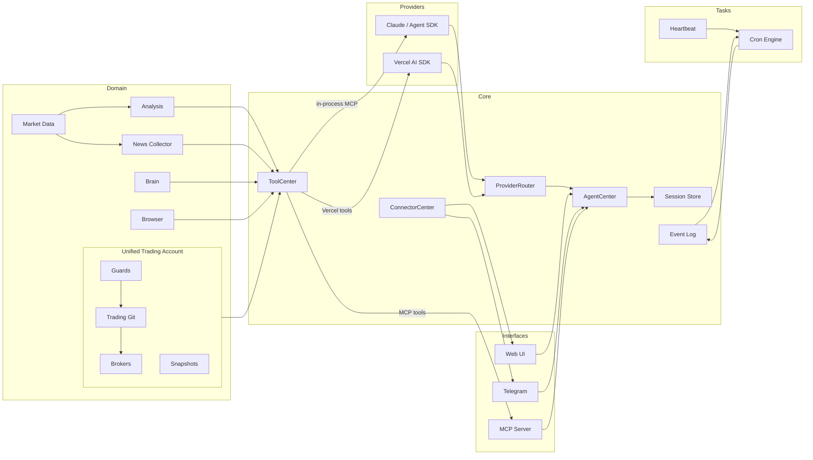
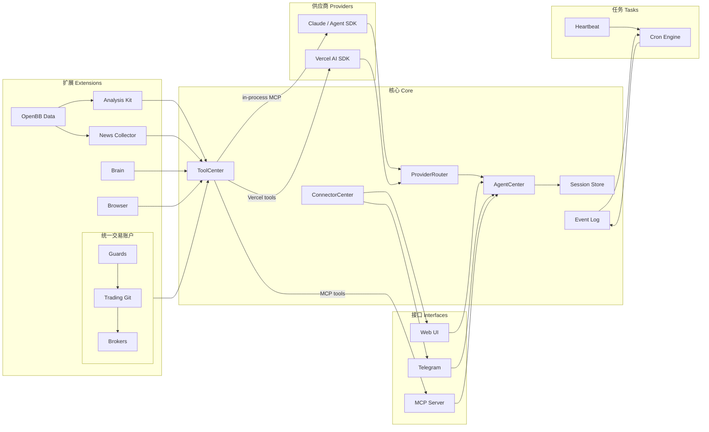

<p align="center">
  
</p>

<p align="center">
  <a href="https://github.com/TraderAlice/OpenAlice/actions/workflows/ci.yml"></a> · <a href="LICENSE"></a> · <a href="https://openalice.ai"></a> · <a href="https://openalice.ai/docs"></a> · <a href="https://deepwiki.com/TraderAlice/OpenAlice"></a>
</p>

# Open Alice

**[English](#english) | [中文](#中文)**

---

<a id="english"></a>

## English

Your one-person Wall Street. Alice is an AI trading agent that gives you your own research desk, quant team, trading floor, and risk management — all running on your laptop 24/7.

- **File-driven** — Markdown defines persona and tasks, JSON defines config, JSONL stores conversations. Both humans and AI control Alice by reading and modifying files. The same read/write primitives that power vibe coding transfer directly to vibe trading. No database, no containers, just files.
- **Reasoning-driven** — every trading decision is based on continuous reasoning and signal mixing.
- **OS-native** — Alice can interact with your operating system. Search the web through your browser, send messages via Telegram, and connect to local devices.

<p align="center">
  
</p>

> [!CAUTION]
> **Open Alice is experimental software in active development.** Many features and interfaces are incomplete and subject to breaking changes. Do not use this software for live trading with real funds unless you fully understand and accept the risks involved. The authors provide no guarantees of correctness, reliability, or profitability, and accept no liability for financial losses.

### Features

- **Multi-provider AI** — switch between Claude (via Agent SDK with OAuth or API key) and Vercel AI SDK at runtime, no restart needed
- **Unified Trading Account (UTA)** — each trading account is a self-contained entity that owns its broker connection, git-like operation history, and guard pipeline. AI interacts with UTAs, never with brokers directly. All order types use IBKR's type system (`@traderalice/ibkr`) as the single source of truth. Supported brokers: CCXT (100+ crypto exchanges), Alpaca (US equities), Interactive Brokers (stocks, options, futures, bonds via TWS/Gateway). Each broker self-registers its config schema and UI field descriptors — adding a new broker requires zero changes to the framework
- **Trading-as-Git** — stage orders, commit with a message, push to execute. Every commit gets an 8-char hash. Full history reviewable via `tradingLog` / `tradingShow`
- **Guard pipeline** — pre-execution safety checks (max position size, cooldown, symbol whitelist) that run inside each UTA before orders reach the broker
- **Market data** — TypeScript-native OpenBB engine (`opentypebb`) with no external sidecar required. Covers equity, crypto, commodity, currency, and macro data with unified symbol search (`marketSearchForResearch`) and technical indicator calculator. Can also expose an embedded OpenBB-compatible HTTP API for external tools
- **Equity research** — company profiles, financial statements, ratios, analyst estimates, earnings calendar, insider trading, and market movers (top gainers, losers, most active)
- **News** — background RSS collection from configurable feeds with archive search tools (`globNews`/`grepNews`/`readNews`)
- **Cognitive state** — persistent "brain" with frontal lobe memory, emotion tracking, and commit history
- **Event log** — persistent append-only JSONL event log with real-time subscriptions and crash recovery
- **Cron scheduling** — event-driven cron system with AI-powered job execution and automatic delivery to the last-interacted channel
- **Evolution mode** — two-tier permission system. Normal mode sandboxes the AI to `data/brain/`; evolution mode gives full project access including Bash, enabling the agent to modify its own source code
- **Account snapshots** — periodic and event-driven account state capture with equity curve visualization. Configurable snapshot intervals and carry-forward for gaps
- **Hot-reload** — enable/disable trading accounts and connectors (Telegram, MCP Ask) at runtime without restart
- **Web UI** — local chat interface with real-time SSE streaming, sub-channels with per-channel AI config, portfolio dashboard with equity curve, and full config management. Dynamic broker config forms rendered from broker-declared schemas

### Key Concepts

**Provider** — The AI backend that powers Alice. Claude (via `@anthropic-ai/claude-agent-sdk`, supports OAuth login or API key) or Vercel AI SDK (direct API calls to Anthropic, OpenAI, Google). Switchable at runtime via `ai-provider.json`.

**Domain** — Business logic layer (`src/domain/`). Each domain module (trading, market-data, analysis, news, brain, thinking) owns its state and persistence. **Tool** (`src/tool/`) is a thin bridge layer that registers domain capabilities as AI tools in ToolCenter.

**UTA (Unified Trading Account)** — The core business entity for trading. Each UTA owns a broker connection (`IBroker`), a git-like operation history (`TradingGit`), a guard pipeline, and a snapshot scheduler. Think of it as a git repository for trades — multiple UTAs are like a monorepo with independent histories. AI and the frontend interact with UTAs exclusively; brokers are internal implementation details. All types (Contract, Order, Execution, OrderState) come from IBKR's type system via `@traderalice/ibkr`. `AccountManager` owns the full UTA lifecycle (create, reconnect, enable/disable, remove).

**Trading-as-Git** — The workflow inside each UTA. Stage operations (`stagePlaceOrder`, `stageClosePosition`, etc.), commit with a message, then push to execute. Push runs guards, dispatches to the broker, snapshots account state, and records a commit with an 8-char hash. Full history is reviewable via `tradingLog` / `tradingShow`.

**Guard** — A pre-execution check that runs inside a UTA before operations reach the broker. Guards enforce limits (max position size, cooldown between trades, symbol whitelist) and are configured per-account.

**Connector** — An external interface through which users interact with Alice. Built-in: Web UI, Telegram, MCP Ask. Connectors register with ConnectorCenter; delivery always goes to the channel of last interaction.

**Brain** — Alice's persistent cognitive state. The frontal lobe stores working memory across rounds; emotion tracking logs sentiment shifts with rationale. Both are versioned as commits.

**Heartbeat** — A periodic check-in where Alice reviews market conditions and decides whether to send you a message. Uses a structured protocol: `HEARTBEAT_OK` (nothing to report), `CHAT_YES` (has something to say), `CHAT_NO` (quiet).

**EventLog** — A persistent append-only JSONL event bus. Cron fires, heartbeat results, and errors all flow through here. Supports real-time subscriptions and crash recovery.

**Evolution Mode** — A permission escalation toggle. Off: Alice can only read/write `data/brain/`. On: full project access including Bash — Alice can modify her own source code.

### Architecture



**Providers** — interchangeable AI backends. Claude (Agent SDK) uses `@anthropic-ai/claude-agent-sdk` with tools delivered via in-process MCP — supports Claude Pro/Max OAuth login or API key. Vercel AI SDK runs a `ToolLoopAgent` in-process with direct API calls. `ProviderRouter` reads `ai-provider.json` on each call to select the active backend at runtime.

**Core** — `AgentCenter` is the top-level orchestration center that routes all calls (both stateless and session-aware) through `ProviderRouter`. `ToolCenter` is a centralized tool registry — `tool/` files register domain capabilities there, and it exports them in Vercel AI SDK and MCP formats. `EventLog` provides persistent append-only event storage (JSONL) with real-time subscriptions and crash recovery. `ConnectorCenter` tracks which channel the user last spoke through.

**Domain** — business logic modules registered as AI tools via the `tool/` bridge layer. The trading domain centers on `UnifiedTradingAccount` (UTA) — each UTA bundles a broker connection, git-like operation history, guard pipeline, and snapshot scheduler into a single entity. Guards enforce pre-execution safety checks (position size limits, trade cooldowns, symbol whitelist) inside each UTA before orders reach the broker. Snapshots capture periodic account state for equity curve tracking. `NewsCollector` runs background RSS fetches into a persistent archive searchable by the agent.

**Tasks** — scheduled background work. `CronEngine` manages jobs and fires `cron.fire` events into the EventLog on schedule; a listener picks them up, runs them through `AgentCenter`, and delivers replies via `ConnectorCenter`. `Heartbeat` is a periodic health-check that uses a structured response protocol (HEARTBEAT_OK / CHAT_NO / CHAT_YES).

**Interfaces** — external surfaces. Web UI for local chat (with SSE streaming and sub-channels), Telegram bot for mobile, MCP server for tool exposure. External agents can also [converse with Alice via a separate MCP endpoint](docs/mcp-ask-connector.md).

### Quick Start

Prerequisites: Node.js 22+, pnpm 10+, [Claude Code CLI](https://docs.anthropic.com/en/docs/claude-code) installed and authenticated.

```bash
git clone https://github.com/TraderAlice/OpenAlice.git
cd OpenAlice
pnpm install && pnpm build
pnpm dev
```

Open [localhost:3002](http://localhost:3002) and start chatting. No API keys or config needed — the default setup uses your local Claude Code login (Claude Pro/Max subscription).

```bash
pnpm dev        # start backend (port 3002) with watch mode
pnpm dev:ui     # start frontend dev server (port 5173) with hot reload
pnpm build      # production build (backend + UI)
pnpm test       # run tests
```

> **Note:** Port 3002 serves the UI only after `pnpm build`. For frontend development, use `pnpm dev:ui` (port 5173) which proxies to the backend and provides hot reload.

### Configuration

All config lives in `data/config/` as JSON files with Zod validation. Missing files fall back to sensible defaults. You can edit these files directly or use the Web UI.

**AI Provider** — The default provider is Claude (Agent SDK), which uses your local Claude Code login — no API key needed. To use the [Vercel AI SDK](https://sdk.vercel.ai/docs) instead (Anthropic, OpenAI, Google, etc.), switch `ai-provider.json` to `vercel-ai-sdk` and add your API key. Both can be switched at runtime via the Web UI.

**Trading** — Unified Trading Account (UTA) architecture. Each account in `accounts.json` becomes a UTA with its own broker connection, git history, and guard config. Broker-specific settings live in the `brokerConfig` field — each broker type declares its own schema and validates it internally.

| File | Purpose |
|------|---------|
| `engine.json` | Trading pairs, tick interval, timeframe |
| `agent.json` | Max agent steps, evolution mode toggle, Claude Code tool permissions |
| `ai-provider.json` | Active AI provider (`agent-sdk` or `vercel-ai-sdk`), login method, switchable at runtime |
| `accounts.json` | Trading accounts with `type`, `enabled`, `guards`, and `brokerConfig` (broker-specific settings) |
| `connectors.json` | Web/MCP server ports, MCP Ask enable |
| `telegram.json` | Telegram bot credentials + enable |
| `web-subchannels.json` | Web UI sub-channel definitions with per-channel AI provider overrides |
| `tools.json` | Tool enable/disable configuration |
| `market-data.json` | Data backend (`typebb-sdk` / `openbb-api`), per-asset-class providers, provider API keys, embedded HTTP server config |
| `news.json` | RSS feeds, fetch interval, retention period |
| `snapshot.json` | Account snapshot interval and retention |
| `compaction.json` | Context window limits, auto-compaction thresholds |
| `heartbeat.json` | Heartbeat enable/disable, interval, active hours |

Persona and heartbeat prompts use a **default + user override** pattern:

| Default (git-tracked) | User override (gitignored) |
|------------------------|---------------------------|
| `default/persona.default.md` | `data/brain/persona.md` |
| `default/heartbeat.default.md` | `data/brain/heartbeat.md` |

On first run, defaults are auto-copied to the user override path. Edit the user files to customize without touching version control.

### Project Structure

Open Alice is a pnpm monorepo with Turborepo build orchestration.

```
packages/
├── ibkr/                      # @traderalice/ibkr — IBKR TWS API TypeScript port
└── opentypebb/                # @traderalice/opentypebb — OpenBB platform TS port
ui/                            # React frontend (Vite, 13 pages)
src/
├── main.ts                    # Composition root — wires everything together
├── core/
│   ├── agent-center.ts        # Top-level AI orchestration, owns ProviderRouter
│   ├── ai-provider-manager.ts # GenerateRouter + StreamableResult + AskOptions
│   ├── tool-center.ts         # Centralized tool registry (Vercel + MCP export)
│   ├── mcp-export.ts          # Shared MCP export layer with type coercion
│   ├── session.ts             # JSONL session store + format converters
│   ├── compaction.ts          # Auto-summarize long context windows
│   ├── config.ts              # Zod-validated config loader
│   ├── event-log.ts           # Append-only JSONL event log
│   ├── connector-center.ts    # ConnectorCenter — push delivery + last-interacted tracking
│   ├── async-channel.ts       # AsyncChannel for streaming provider events to SSE
│   ├── tool-call-log.ts       # Tool invocation logging
│   ├── media.ts               # MediaAttachment extraction
│   ├── media-store.ts         # Media file persistence
│   └── types.ts               # Plugin, EngineContext interfaces
├── ai-providers/
│   ├── vercel-ai-sdk/         # Vercel AI SDK ToolLoopAgent wrapper
│   ├── agent-sdk/             # Claude backend (@anthropic-ai/claude-agent-sdk, OAuth + API key)
│   └── mock/                  # Mock provider (testing)
├── domain/
│   ├── trading/               # Unified multi-account trading, guard pipeline, git-like commits
│   │   ├── account-manager.ts # UTA lifecycle (init, reconnect, enable/disable) + registry
│   │   ├── git-persistence.ts # Git state load/save
│   │   ├── brokers/
│   │   │   ├── registry.ts    # Broker self-registration (configSchema + configFields + fromConfig)
│   │   │   ├── alpaca/        # Alpaca (US equities)
│   │   │   ├── ccxt/          # CCXT (100+ crypto exchanges)
│   │   │   ├── ibkr/          # Interactive Brokers (TWS/Gateway)
│   │   │   └── mock/          # In-memory test broker
│   │   ├── git/               # Trading-as-Git engine (stage → commit → push)
│   │   ├── guards/            # Pre-execution safety checks (position size, cooldown, whitelist)
│   │   └── snapshot/          # Periodic + event-driven account state capture, equity curve
│   ├── market-data/           # Structured data layer (opentypebb in-process + OpenBB API remote)
│   │   ├── equity/            # Equity data + SymbolIndex (SEC/TMX local cache)
│   │   ├── crypto/            # Crypto data layer
│   │   ├── currency/          # Currency/forex data layer
│   │   ├── commodity/         # Commodity data layer (EIA, spot prices)
│   │   ├── economy/           # Macro economy data layer
│   │   └── client/            # Data backend clients (opentypebb SDK, openbb-api)
│   ├── analysis/              # Indicators, technical analysis
│   ├── news/                  # RSS collector + archive search
│   ├── brain/                 # Cognitive state (memory, emotion)
│   └── thinking/              # Safe expression evaluator
├── tool/                      # AI tool definitions — thin bridge from domain to ToolCenter
│   ├── trading.ts             # Trading tools (delegates to domain/trading)
│   ├── equity.ts              # Equity fundamental tools
│   ├── market.ts              # Symbol search tools
│   ├── analysis.ts            # Indicator calculation tools
│   ├── news.ts                # News archive tools
│   ├── brain.ts               # Cognition tools
│   ├── thinking.ts            # Reasoning tools
│   ├── browser.ts             # Browser automation tools (wraps openclaw)
│   └── session.ts             # Session awareness tools
├── server/
│   ├── mcp.ts                 # MCP protocol server
│   └── opentypebb.ts          # Embedded OpenBB-compatible HTTP API (optional)
├── connectors/
│   ├── web/                   # Web UI (Hono, SSE streaming, sub-channels)
│   ├── telegram/              # Telegram bot (grammY, magic link auth, /trading panel)
│   ├── mcp-ask/               # MCP Ask connector (external agent conversation)
│   └── mock/                  # Mock connector (testing)
├── task/
│   ├── cron/                  # Cron scheduling (engine, listener, AI tools)
│   └── heartbeat/             # Periodic heartbeat with structured response protocol
└── openclaw/                  # ⚠️ Frozen — DO NOT MODIFY
data/
├── config/                    # JSON configuration files
├── sessions/                  # JSONL conversation histories (web/, telegram/, cron/)
├── brain/                     # Agent memory and emotion logs
├── cache/                     # API response caches
├── trading/                   # Trading commit history + snapshots (per-account)
├── news-collector/            # Persistent news archive (JSONL)
├── cron/                      # Cron job definitions (jobs.json)
├── event-log/                 # Persistent event log (events.jsonl)
├── tool-calls/                # Tool invocation logs
└── media/                     # Uploaded attachments
default/                       # Factory defaults (persona, heartbeat, skills)
docs/                          # Documentation
```

### Roadmap to v1

Open Alice is in pre-release. All planned v1 milestones are now complete — remaining work is testing and stabilization.

- [x] **Tool confirmation** — achieved through Trading-as-Git's push approval mechanism. Order execution requires explicit user approval at the push step, similar to merging a PR
- [x] **Trading-as-Git stable interface** — the core workflow (stage → commit → push → approval) is stable and running in production
- [x] **IBKR broker** — Interactive Brokers integration via TWS/Gateway. `IbkrBroker` bridges the callback-based `@traderalice/ibkr` SDK to the Promise-based `IBroker` interface via `RequestBridge`. Supports all IBroker methods including conId-based contract resolution
- [x] **Account snapshot & analytics** — periodic and event-driven snapshots with equity curve visualization, configurable intervals, and carry-forward for data gaps

---

<a id="中文"></a>

## 中文

你的一人华尔街。Alice 是一个 AI 交易代理，为你提供专属的研究部门、量化团队、交易席位和风险管理 —— 全部在你的笔记本电脑上 24/7 运行。

- **文件驱动** — Markdown 定义人设和任务，JSON 定义配置，JSONL 存储对话。人和 AI 通过读写文件来控制 Alice。驱动 vibe coding 的读写原语可以直接迁移到 vibe trading。无需数据库，无需容器，只有文件。
- **推理驱动** — 每一个交易决策都基于持续的推理和信号融合。
- **操作系统原生** — Alice 可以与你的操作系统交互。通过浏览器搜索网络，通过 Telegram 发送消息，连接本地设备。

<p align="center">
  
</p>

> [!CAUTION]
> **Open Alice 是处于活跃开发中的实验性软件。** 许多功能和接口尚不完整，可能会发生破坏性变更。除非你完全理解并接受所涉及的风险，否则请勿使用本软件进行真实资金的实盘交易。作者不对正确性、可靠性或盈利能力提供任何保证，也不承担任何经济损失的责任。

### 功能特性

- **多供应商 AI** — 在 Claude（通过 Agent SDK，支持 OAuth 或 API 密钥）和 Vercel AI SDK 之间运行时切换，无需重启
- **统一交易账户 (UTA)** — 每个交易账户是一个自包含实体，拥有自己的经纪商连接、类 Git 操作历史和守卫管道。AI 与 UTA 交互，而非直接与经纪商交互。所有订单类型使用 IBKR 的类型系统（`@traderalice/ibkr`）作为唯一真实来源，Alpaca 和 CCXT 适配该系统
- **交易即 Git** — 暂存订单，提交注释，推送执行。每次提交获得 8 字符哈希。完整历史可通过 `tradingLog` / `tradingShow` 查看
- **守卫管道** — 在每个 UTA 内部运行的预执行安全检查（最大持仓大小、冷却期、标的白名单），在订单到达经纪商之前执行
- **市场数据** — TypeScript 原生 OpenBB 引擎（`opentypebb`），无需外部 sidecar。覆盖股票、加密货币、商品、外汇和宏观数据，提供统一标的搜索（`marketSearchForResearch`）和技术指标计算器。也可以为外部工具暴露一个内嵌的 OpenBB 兼容 HTTP API
- **股票研究** — 公司概况、财务报表、财务比率、分析师预估、财报日历、内幕交易以及市场热点（涨幅榜、跌幅榜、最活跃）
- **新闻** — 从可配置的 RSS 源进行后台新闻收集，提供归档搜索工具（`globNews`/`grepNews`/`readNews`）
- **认知状态** — 持久化的"大脑"，包含前额叶记忆、情绪追踪和提交历史
- **事件日志** — 持久化的只追加 JSONL 事件日志，支持实时订阅和崩溃恢复
- **定时调度** — 事件驱动的 Cron 系统，具有 AI 驱动的任务执行和自动发送到最近交互频道的功能
- **进化模式** — 两级权限系统。普通模式将 AI 沙箱限制在 `data/brain/`；进化模式授予完整项目访问权限包括 Bash，使代理能够修改自身源代码
- **热重载** — 在运行时启用/禁用连接器（Telegram、MCP Ask）和重连交易引擎，无需重启
- **Web UI** — 本地聊天界面，支持实时 SSE 流式传输、带有每频道 AI 配置的子频道、投资组合仪表盘以及完整的配置管理（交易、数据源、连接器、AI 供应商、心跳、工具）

### 核心概念

**供应商 (Provider)** — 驱动 Alice 的 AI 后端。Claude（通过 `@anthropic-ai/claude-agent-sdk`，支持 OAuth 登录或 API 密钥）或 Vercel AI SDK（直接 API 调用 Anthropic、OpenAI、Google）。可通过 `ai-provider.json` 在运行时切换。

**扩展 (Extension)** — 注册在 ToolCenter 中的自包含工具包。每个扩展拥有自己的工具、状态和持久化。示例：trading、brain、analysis-kit。

**统一交易账户 (UTA)** — 交易的核心业务实体。每个 UTA 拥有一个经纪商连接（`IBroker`）、类 Git 操作历史（`TradingGit`）和守卫管道。可以把它想象成交易的 Git 仓库 —— 多个 UTA 就像一个拥有独立历史的 monorepo。AI 和前端只与 UTA 交互；经纪商是内部实现细节。所有类型（Contract、Order、Execution、OrderState）来自 IBKR 的类型系统（`@traderalice/ibkr`）。

**交易即 Git (Trading-as-Git)** — UTA 内部的工作流。暂存操作（`stagePlaceOrder`、`stageClosePosition` 等），提交注释，然后推送执行。推送会运行守卫、派发到经纪商、快照账户状态，并记录一个带 8 字符哈希的提交。完整历史可通过 `tradingLog` / `tradingShow` 查看。

**守卫 (Guard)** — 在 UTA 内部运行的预执行检查，在操作到达经纪商之前执行。守卫强制执行限制（最大持仓大小、交易间冷却期、标的白名单），按账户配置。

**连接器 (Connector)** — 用户与 Alice 交互的外部接口。内置：Web UI、Telegram、MCP Ask。连接器注册到 ConnectorCenter；消息始终发送到最近交互的频道。

**大脑 (Brain)** — Alice 的持久认知状态。前额叶存储跨轮次的工作记忆；情绪追踪记录情感变化及其理由。两者都以提交的形式进行版本控制。

**心跳 (Heartbeat)** — 定期检查，Alice 审视市场状况并决定是否给你发消息。使用结构化协议：`HEARTBEAT_OK`（无事汇报）、`CHAT_YES`（有话要说）、`CHAT_NO`（保持安静）。

**事件日志 (EventLog)** — 持久化的只追加 JSONL 事件总线。定时任务触发、心跳结果和错误都通过此处流转。支持实时订阅和崩溃恢复。

**进化模式 (Evolution Mode)** — 权限提升开关。关闭：Alice 只能读写 `data/brain/`。开启：完整项目访问权限包括 Bash —— Alice 可以修改自己的源代码。

### 架构



**供应商** — 可互换的 AI 后端。Claude (Agent SDK) 使用 `@anthropic-ai/claude-agent-sdk`，通过进程内 MCP 传递工具 — 支持 Claude Pro/Max OAuth 登录或 API 密钥。Vercel AI SDK 在进程内运行 `ToolLoopAgent` 进行直接 API 调用。`ProviderRouter` 在每次调用时读取 `ai-provider.json` 以选择运行时的活跃后端。

**核心** — `AgentCenter` 是顶层编排中心，通过 `ProviderRouter` 路由所有调用（无状态和会话感知）。`ToolCenter` 是集中式工具注册表 — 扩展在此注册工具，并以 Vercel AI SDK 和 MCP 格式导出。`EventLog` 提供持久化的只追加事件存储（JSONL），支持实时订阅和崩溃恢复。`ConnectorCenter` 跟踪用户最近通过哪个频道交流。

**扩展** — 注册在 `ToolCenter` 中的领域特定工具集。每个扩展拥有自己的工具、状态和持久化。交易扩展以 `UnifiedTradingAccount` (UTA) 为核心 — 每个 UTA 将经纪商连接、类 Git 操作历史和守卫管道捆绑为单一实体。守卫在每个 UTA 内部执行预执行安全检查（持仓大小限制、交易冷却期、标的白名单），在订单到达经纪商之前。`NewsCollector` 在后台运行 RSS 抓取，存入代理可搜索的持久化归档。

**任务** — 后台定时工作。`CronEngine` 管理任务并按计划向 EventLog 触发 `cron.fire` 事件；监听器接收事件，通过 `AgentCenter` 运行，并通过 `ConnectorCenter` 发送回复。`Heartbeat` 是定期健康检查，使用结构化响应协议（HEARTBEAT_OK / CHAT_NO / CHAT_YES）。

**接口** — 外部界面。Web UI 用于本地聊天（支持 SSE 流式传输和子频道），Telegram 机器人用于移动端，MCP 服务器用于工具暴露。外部代理也可以[通过单独的 MCP 端点与 Alice 对话](docs/mcp-ask-connector.md)。

### 快速开始

前置条件：Node.js 22+、pnpm 10+、[Claude Code CLI](https://docs.anthropic.com/en/docs/claude-code) 已安装并完成认证。

```bash
git clone https://github.com/TraderAlice/OpenAlice.git
cd OpenAlice
pnpm install && pnpm build
pnpm dev
```

打开 [localhost:3002](http://localhost:3002) 开始聊天。无需 API 密钥或配置 — 默认设置使用你本地的 Claude Code 登录（Claude Pro/Max 订阅）。

```bash
pnpm dev        # 启动后端（端口 3002），带监视模式
pnpm dev:ui     # 启动前端开发服务器（端口 5173），带热重载
pnpm build      # 生产构建（后端 + UI）
pnpm test       # 运行测试
```

> **注意：** 端口 3002 仅在 `pnpm build` 之后提供 UI 服务。进行前端开发时，请使用 `pnpm dev:ui`（端口 5173），它会代理到后端并提供热重载。

### 配置

所有配置位于 `data/config/`，采用带有 Zod 校验的 JSON 文件。缺失的文件会回退到合理的默认值。你可以直接编辑这些文件或使用 Web UI。

**AI 供应商** — 默认供应商是 Claude (Agent SDK)，使用你本地的 Claude Code 登录 — 无需 API 密钥。要改用 [Vercel AI SDK](https://sdk.vercel.ai/docs)（Anthropic、OpenAI、Google 等），将 `ai-provider.json` 切换为 `vercel-ai-sdk` 并添加你的 API 密钥。两者都可以通过 Web UI 在运行时切换。

**交易** — 统一交易账户 (UTA) 架构。在 `platforms.json` 中定义平台（CCXT 交易所、Alpaca），然后在 `accounts.json` 中创建引用平台的账户。每个账户成为一个拥有独立 Git 历史和守卫配置的 UTA。旧版 `crypto.json` 和 `securities.json` 仍然支持。

| 文件 | 用途 |
|------|------|
| `engine.json` | 交易对、Tick 间隔、时间周期 |
| `agent.json` | 最大代理步数、进化模式开关、Claude Code 工具权限 |
| `ai-provider.json` | 活跃 AI 供应商（`agent-sdk` 或 `vercel-ai-sdk`）、登录方式、运行时可切换 |
| `platforms.json` | 交易平台定义（CCXT 交易所、Alpaca） |
| `accounts.json` | 交易账户凭证和守卫配置，引用平台 |
| `crypto.json` | CCXT 交易所配置 + API 密钥、允许的标的、守卫 |
| `securities.json` | Alpaca 经纪商配置 + API 密钥、允许的标的、守卫 |
| `connectors.json` | Web/MCP 服务器端口、MCP Ask 启用 |
| `telegram.json` | Telegram 机器人凭证 + 启用 |
| `web-subchannels.json` | Web UI 子频道定义，带有每频道 AI 供应商覆盖 |
| `tools.json` | 工具启用/禁用配置 |
| `market-data.json` | 数据后端（`typebb-sdk` / `openbb-api`）、按资产类别的供应商、供应商 API 密钥、内嵌 HTTP 服务器配置 |
| `news.json` | RSS 源、抓取间隔、保留期限 |
| `compaction.json` | 上下文窗口限制、自动压缩阈值 |
| `heartbeat.json` | 心跳启用/禁用、间隔、活跃时间段 |

人设和心跳提示词使用 **默认 + 用户覆盖** 模式：

| 默认（纳入版本控制） | 用户覆盖（gitignore） |
|----------------------|----------------------|
| `data/default/persona.default.md` | `data/brain/persona.md` |
| `data/default/heartbeat.default.md` | `data/brain/heartbeat.md` |

首次运行时，默认文件会自动复制到用户覆盖路径。编辑用户文件即可自定义，无需触碰版本控制。

### 项目结构

```
src/
  main.ts                    # 组合根 — 连接所有组件
  core/
    agent-center.ts          # 顶层 AI 编排中心，拥有 ProviderRouter
    ai-provider.ts           # AIProvider 接口 + ProviderRouter（运行时切换）
    tool-center.ts           # 集中式工具注册表（Vercel + MCP 导出）
    ai-config.ts             # 运行时供应商配置读写
    model-factory.ts         # Vercel AI SDK 模型实例工厂
    session.ts               # JSONL 会话存储 + 格式转换器
    compaction.ts            # 自动摘要长上下文窗口
    config.ts                # Zod 校验的配置加载器
    event-log.ts             # 持久化只追加事件日志（JSONL）
    connector-center.ts      # ConnectorCenter — 推送投递 + 最近交互跟踪
    async-channel.ts         # AsyncChannel 用于将供应商事件流式传输到 SSE
    provider-utils.ts        # 共享供应商工具（会话转换、工具桥接）
    media.ts                 # 从工具输出中提取 MediaAttachment
    media-store.ts           # 媒体文件持久化
    types.ts                 # Plugin、EngineContext 接口
  ai-providers/
    vercel-ai-sdk/           # Vercel AI SDK ToolLoopAgent 包装器
    agent-sdk/               # Claude 后端（@anthropic-ai/claude-agent-sdk，OAuth + API 密钥）
  extension/
    analysis-kit/            # 指标计算器和市场数据工具
    equity/                  # 股票基本面和数据适配器
    market/                  # 跨股票、加密货币、外汇的统一标的搜索
    news/                    # RSS 收集器、归档搜索工具
    trading/                 # 统一交易账户 (UTA)：经纪商、类 Git 提交、守卫、AI 工具适配器
      UnifiedTradingAccount.ts  # UTA 类 — 拥有经纪商 + Git + 守卫
      brokers/               # IBroker 接口 + Alpaca/CCXT 实现
      git/                   # 交易即 Git 引擎（暂存 → 提交 → 推送）
      guards/                # 预执行安全检查（持仓大小、冷却期、白名单）
      adapter.ts             # AI 工具定义（Zod schema → UTA 方法）
      account-manager.ts     # 多 UTA 注册表和路由
    thinking-kit/            # 推理和计算工具
    brain/                   # 认知状态（记忆、情绪）
    browser/                 # 浏览器自动化桥接（通过 OpenClaw）
  openbb/
    sdk/                     # 进程内 opentypebb SDK 客户端（股票、加密货币、外汇、新闻、经济、商品）
    api-server.ts            # 内嵌 OpenBB 兼容 HTTP 服务器（可选，端口 6901）
    equity/                  # 股票数据层 + SymbolIndex（SEC/TMX 本地缓存）
    crypto/                  # 加密货币数据层
    currency/                # 外汇数据层
    commodity/               # 商品数据层（EIA、现货价格）
    economy/                 # 宏观经济数据层
    news/                    # 新闻数据层
    credential-map.ts        # 将配置键名映射到 OpenBB 凭证字段名
  connectors/
    web/                     # Web UI 聊天（Hono、SSE 流式传输、子频道）
    telegram/                # Telegram 机器人（grammY、轮询、命令）
    mcp-ask/                 # MCP Ask 连接器（外部代理对话）
  task/
    cron/                    # 定时调度（引擎、监听器、AI 工具）
    heartbeat/               # 带有结构化响应协议的定期心跳
  plugins/
    mcp.ts                   # 用于工具暴露的 MCP 服务器
  skills/                    # 代理技能定义
  openclaw/                  # 浏览器自动化子系统（已冻结）
data/
  config/                    # JSON 配置文件
  default/                   # 出厂默认值（人设、心跳提示词）
  sessions/                  # JSONL 对话历史
  brain/                     # 代理记忆和情绪日志
  cache/                     # API 响应缓存
  trading/                   # 交易提交历史（按账户）
  news-collector/            # 持久化新闻归档（JSONL）
  cron/                      # 定时任务定义（jobs.json）
  event-log/                 # 持久化事件日志（events.jsonl）
docs/                        # 架构文档
```

### v1 路线图

Open Alice 处于预发布阶段。以下事项需要在第一个稳定版本之前完成：

- [ ] **工具确认** — 敏感工具（下单、撤单、平仓）在执行前需要用户明确确认，并提供按工具设置的受信工作流绕过机制
- [ ] **交易即 Git 稳定接口** — UTA 类和 Git 工作流已可用；剩余工作是序列化格式（用于 Operation 持久化的类 FIX tag-value 编码）和 `tradingSync` 轮询循环
- [ ] **IBKR 经纪商** — 通过 TWS API 集成盈透证券。`@traderalice/ibkr` TypeScript SDK（完整的 TWS 协议移植）已完成；剩余工作是实现 `IBroker` 接口
- [ ] **账户快照与分析** — 统一交易账户快照，包括盈亏分解、敞口分析和历史绩效追踪

## Star History

[](https://star-history.com/#TraderAlice/OpenAlice&Date)